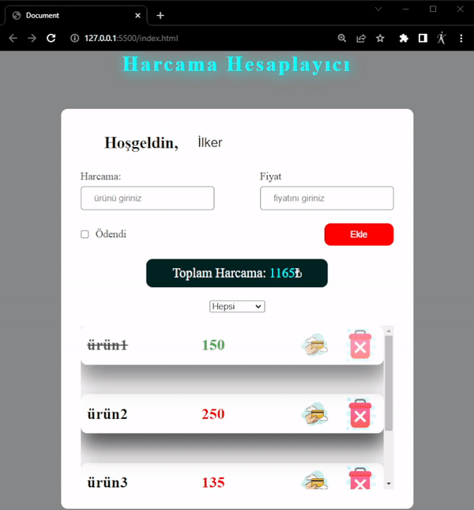

# spending_calc_js

<h3> HARCAMA HESAPLAYICI</h3>

Bu projede javascript kullanarak harcama hesaplayıcı yapıldı.

Her harcama kartının ekranda gözükmesi için nesneler diknamikleştirildi.

Ödeme seçeneği ile ödenen ürünlerin rengi farklı şekilde belirtildi.

Açılır menü ile ödenen ve ödenmeyen ürünler ayrı ayrı listelenebiliyor.

------   ------   ------

<h3> EXPENSE CALCULATOR </h3>

This project was created using JavaScript to build an expense calculator.

Objects were dynamically created to display each expense card on the screen.

The color of items paid with the payment option is indicated differently.

Paid and unpaid items can be listed separately with a dropdown menu.

